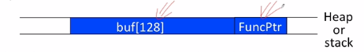
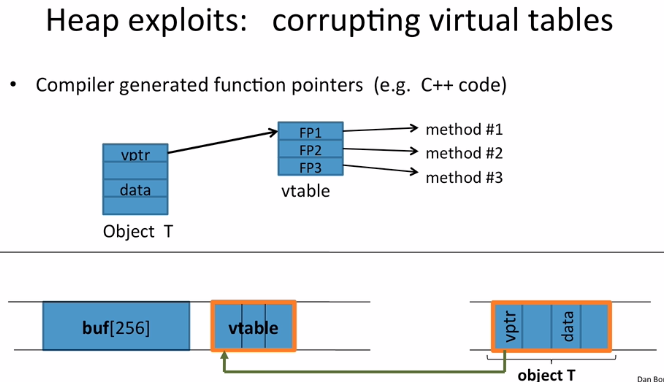
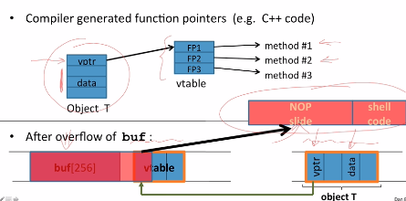
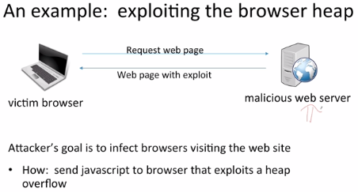
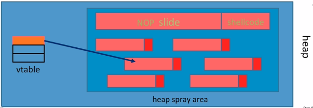
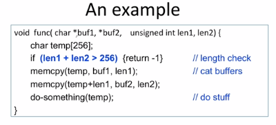
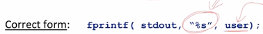
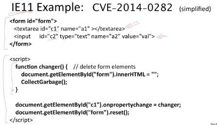
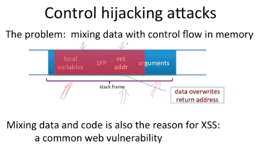

# Control Flow Hijacking

Control Flow hijacking continues to present software vulnerabilities that attackers can exploit to take control over a target machine. Known tactics and some mitigation methods are listed below.

<hr>

## Heap Overflows

### Buffer Overflow
See [Buffer Overflow](https://www.github.com/kevinkong91/buffer-overflow-exploit) for a full example.

Other Exploits:
- Exception handlers
  - Overwrite the address of an exception handler in stack frame
  - e.g. Windows SEH
- Function pointers
  - Overflow a buffer to overwrite a function pointer
  - e.g. PHP 4.0.2 & MS MediaPlayer Bitmaps
  
- Longjmp buffers (`longjmp(pos)`)
  - Overflow a buffer next to `pos` overrides value o `pos`
  - e.g. Perl 5.003

### Heap Spraying

Similar to the Buffer Overflow, an attacker leverages the control flow of the memory heap to run the payload on the host machine.

Programs (e.g. C++) that compile to generate **function pointers** are the target. Such programs will allocate a virtual table object on the _heap_ that points to a `vtable` of function pointers, which, in turn, point to methods held in memory.



Exploited with an overflow:



The exact location of the payload is not known, so the attacker "sprays" the malicious code in the memory heap to maximize the probability that the control flow will direct the execution towards one of the NOP slides.

#### Example



1. Use JS to spray heap with shell code + NOP slides
2. Point vtable ptr anywhere in spray area
   
```
<script language="text/javascript">
    shellcode = unescape("%u4343%u4343%..."); // allocate in heap
    overflow-string = unescape("%u2332%u4276%...");
    cause-overflow(overflow-string); // overflow buf[]
</script>
```

```
var nop = unescape("%u9090%u9090")
while (nop.length < 0x1000000) nop += nop;

var shellcode = unescape("%u4343%u4343%...")

var x = new Array()
for (i=0; i<1000; i++) {
    x[i] = nop + shellcode;
}
```

Pointing function-ptr almost anywhere in the heap will cause shellcode to execute.



#### Impact
When one attacks a browser, the attacker is most likely to create a backdoor on the victim machine to gain access later and turn into a bot.

#### Mitigation
Ad-hoc techniques:

- Better browser architecture
  - Store JS strings in a separate heap from browser heap
- **Guard Pages**
  - _Non-writable pages prevent cross-page overflows_
  - Good, but ineffective against overflows contained within a single page.
  - Used in OpenBSD and Windows 8 systems
- NOP slide detection
  - _Detection for anomalous density of NOP slides_
  - Not as effective - many NOP slides can be arbitrary and can now also be English texts. High variability and options for the attacker.
- Fuzzer is a tool that automatically bombards a target machine with malformed requests. The attacker or defender can spot overflow locations in core dump (`$$$$$`)

<hr>

## Integer Overflow

When an `int` exceeds max value, say if `char c` is 255, it takes more than the allowed 8 bits to represent the value, causes a "wrap-around" and sets the variable `c = 0`. Exploits arise from this false equivalency:

```
int m; (32 bits)
short s; (16 bits)
char c; (8 bits)

c = 0x80 + 0x80 = 128 + 128     => c = 0
s = 0xff80 + 0x80               => s = 0
m = 0xfffffff80 + 0x80          => m = 0
```

Example:



If `len1 = 0x80` and `len2 = 0xffffff80` (greater than 256), then the variables are set to `0`, so the `len1 + len2` guard passes and long string inputs get `memcpy`'d past the buffer into unsafe areas.

Examples:
e.g. MS DirectX MIDI Lib

<hr>

## Format String

Vulnerable code:
```
int func(char *user) {
    fprintf(stderr, user);
}
```

Problem: what if `*user = "%s%s%s%s%s%s%s"`?

- **Lower bound of risk:** (High probability) the program will crash and cause DoS.
- **Upper bound of risk** (Lower probability) program will print memory contents (user passwords, session keys, server keys). Privacy or security issues.

### Mitigation

Use correct form for Format Strings. Always provide an **explicit format string** and never relinquish control over the format string and take user input as an **argument**:




<hr>

## Double Free

Double free space on heap
- can cause memory manager to write data to specific location
- e.g. CVS server

<hr>

## Use After Free

Exploit leveraging memory after it is freed.

### Example:



Components:
1. Standard HTML `<form>` with:
   1. `<textarea />`
   2. `<input />`
2. Script with `changer()` that destroys `c1` & `c2`
   
Steps:
3. Attacker attaches this script to `onPropertyChange` handler and `reset`s the form => for each element, reset the element.
4. When `c1` Textarea resets,it deallocates `c1` & `c2` in the middle of the loop; in the next iteration, `reset()` is called on an element that has been freed on the heap.
5. EXPLOIT: attacker allocates string in the same memory freed by `c2`. Instead of `reset()`, the new command gets called.

<hr>

## BIG PICTURE

Root cause of most exploits: **Mixing Data & Control**.

Ancient Problem: In 1970s, 2600 Hz signal sent by caller who hung up to the switch to stop billing. People generated the signal themselves to stop billing prematurely.

Modern problem: Mixing data with control flows in memory



