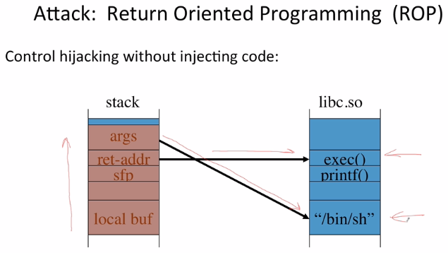
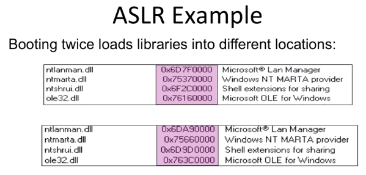
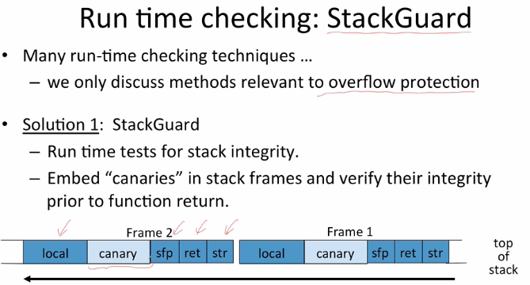
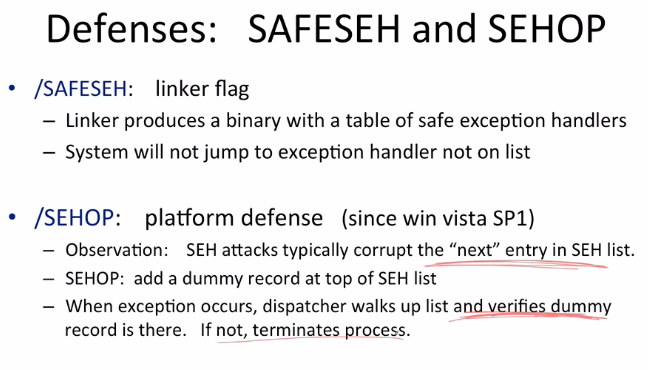
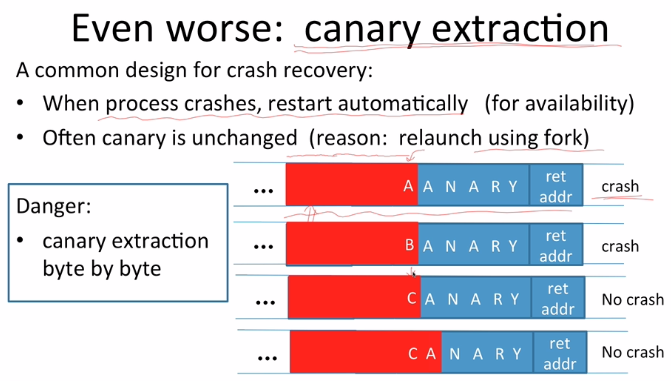
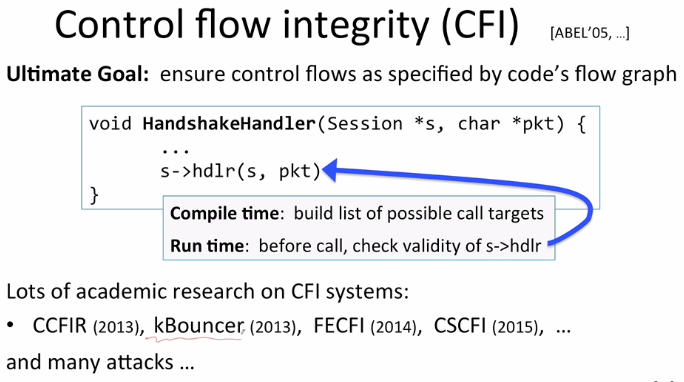
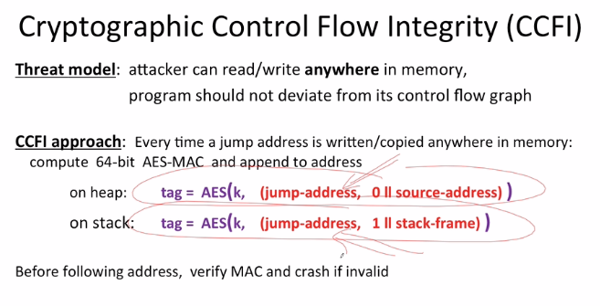

# Mitigations for Control Flow Hijacking

Control Flow hijacking continues to present software vulnerabilities that attackers can exploit to take control over a target machine. Known tactics and some mitigation methods are listed below.

## Basic Methods

- Fix bugs:
  - Automated audit software
    - [Synopsys Coverity](https://scan.coverity.com/)
    - [Prefast/Prefix](https://www.codeproject.com/Articles/167588/Using-PREfast-for-Static-Code-Analysis)
  - Rewrite software in a type safe language (Java, ML)
    - Difficult for existing (legacy), and omnipresent code (C, C++)
- Platform defenses: prevent attack code execution - mitigate Complete Breaches to DoS instead.
- Add runtime code to detect overflows
  - Halt process when overflow detected
  - Examples:
    - [StackGuard](https://www.usenix.org/legacy/publications/library/proceedings/sec98/full_papers/cowan/cowan.pdf)
    - [CFI](https://nebelwelt.net/blog/20160913-ControlFlowIntegrity.html)
    - [LibSafe](https://directory.fsf.org/wiki/Libsafe)

## Data Execution Prevention (DEP) Methods

### Marking memory as non-execute

Prevent attack code execution by marking stack and heap as **non-executable**.

- NX-bit on AMD Athlon 64, XD(execute-disabled)-bit on Intel P4 Prescott
- NX bit in every Page Table Entry (PTE)
- Deployment
  - Linux (via PaX project) - OpenBSD
  - Windows: since XP SP2 (DEP)
    - Visual Studio / NXCompat[:NO]
- Limitations
  - Some apps legitimately need executable heap (e.g. JITs)
    - **Just-in-time Compilers** in browsers download JS from the server, compiles them in the heap, and jump into the heap to execute the compiled JS.

Unfortunately, can be easily bypassed using Return Orientation Programming (ROP)

### Attack: Return Oriented Programming (ROP)

An attacker can control hijack without injecting code:

The attacker will leverage existing system libraries, like `libc.so` (contains modules for `fprintf`, `printf`, `exec()` etc.) contain a string "/bin/sh" to launch an exploit. The attacker will overflow a buffer, point the return address to `exec()` in the vulnerable system library, and point the argument address at the "/bin/sh". The attacker will launch a shell using code already existing in system memory.

## Platform Defenses:

### Address Space Layout Randomization (ASLR)

Each mapping of memory will be different than the next.

Map shared libraries to random location in process memory. Attackers cannot jump directly to `exec()`.

Deployment:

- Windows 7: 8 bits of randomness for DLLs - 256 attempts would compromise.
- Windows 8: 24 bits of randomness on 64-bit processors - attacker must guess 24-bit number to locate `exec()` - 2^24 = 1 in 16 million.

Other randomizatin methods:

- Sys-call randomization: randomize sys-call id's
- Instruction Set Randomization (ISR)

NOTE: **Everything in process memory must be randomized**: stack, heap, shared libs, base image.

### kBouncer (kernal bouncer)

Observation: abnormal execution sequence where `ret` returns to an address that does not follow a call.

Before a syscall, check that every prior ret is not abnormal. See Intel's _Last Branch Recording_ (LBR).

## Runtime Checks

### StackGuard

- Run time tests for stack integrity
- Embed "canaries" in stack frames and verify their integrity prior to function return.

#### Canary Types

Random canary:

- Random string chosen at program startup
- Insert canary string into each stack frame
- Verify canary before return from function
  - Exit program if canary changed; Mitigate potential exploit into DoS.
- To corrupt, attacker must learn current random string.

Terminator canary:

- Examples: { 0, newline, linefeed, EOF }
- String functions will not copy beyond terminator
- Attacker cannot use string functions (`strcpy`) to corrupt the stack.
- Attacker can still use `memcpy` and other non-string overflows.

NOTE: Canaries are not an airtight solution. Attackers can leave canaries unchanged and use local pointers to point to the return address to point to the overflow.

### Defenses for Exception Handler Overflows

### Canary Summary

Canaries are not foolproof.

- Heap-based attacks are still possible.
- Integer overflow attacks still possible
- /GS by itself does not prevent Exception Handling attacks (also need SAFESEH & SEHOP)

#### Canary Extraction

Common design for crash discovery

- When process crashes, restart automatically (for availability), especially in web server
- Often canary is unchanged, fixed for the life of the process (reason: relaunch using fork, e.g. Linux server)

### Libsafe

Tool for when we can't recompile the program?

Dynamically loaded library

- Intercept calls to `strcpy` (dest, src)
- Validates sufficient space in current stack frame

### Shadow Stack

**Keep a copy of the stack in memory.** Very popular method.

On `call`: push ret-address to shadow stack on call
On `ret`: check that top of the shadow stack is equal on the ret-address on the stack. Crash if not.
Security: memory corruption should not corrupt shadow stack

## Control flow integrity (CFI)

Ultimate Goal: ensure control flows as specified by the code's flow graph

At Compile time, the compiler will build a list of possible call targes for a handler. At run-time, the program will check for the validity of the handler's targets.

